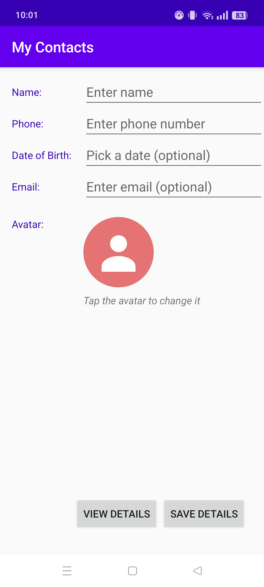
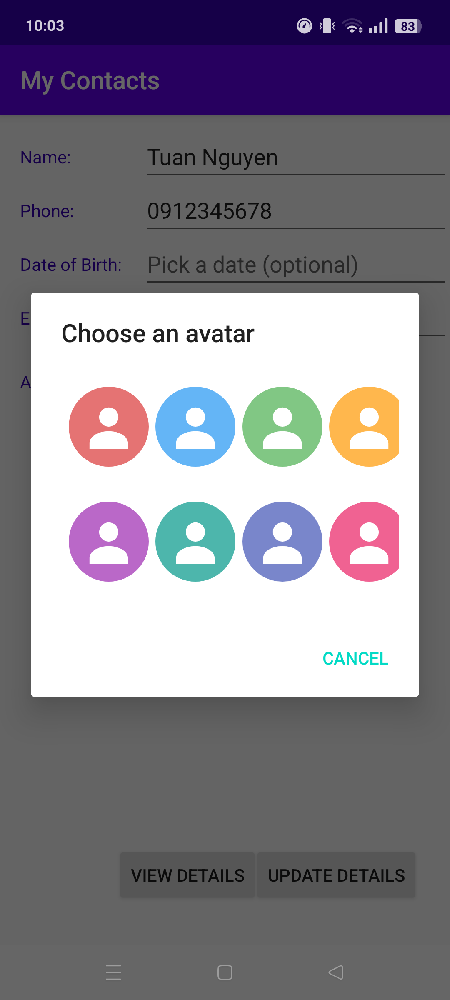
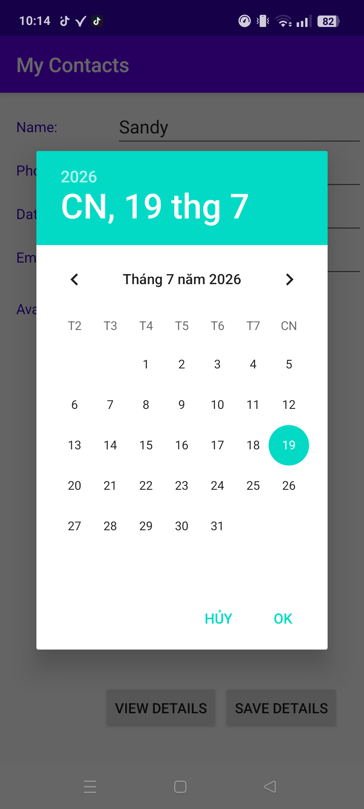
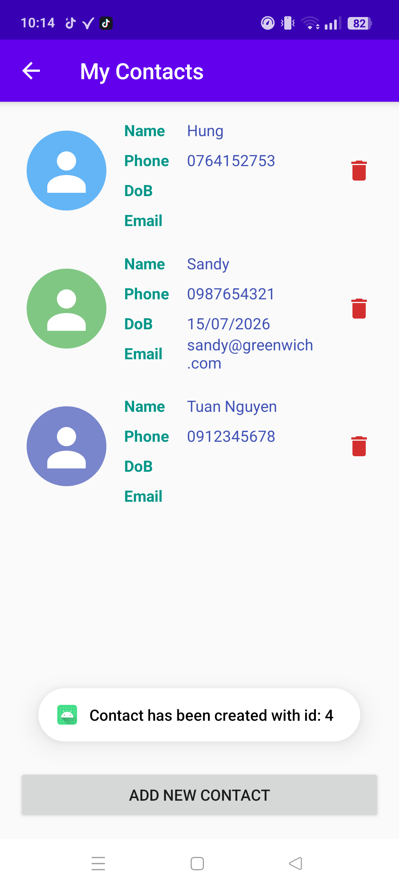
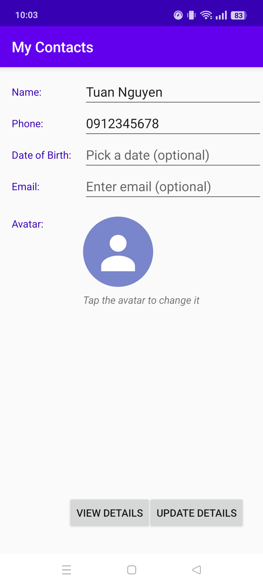
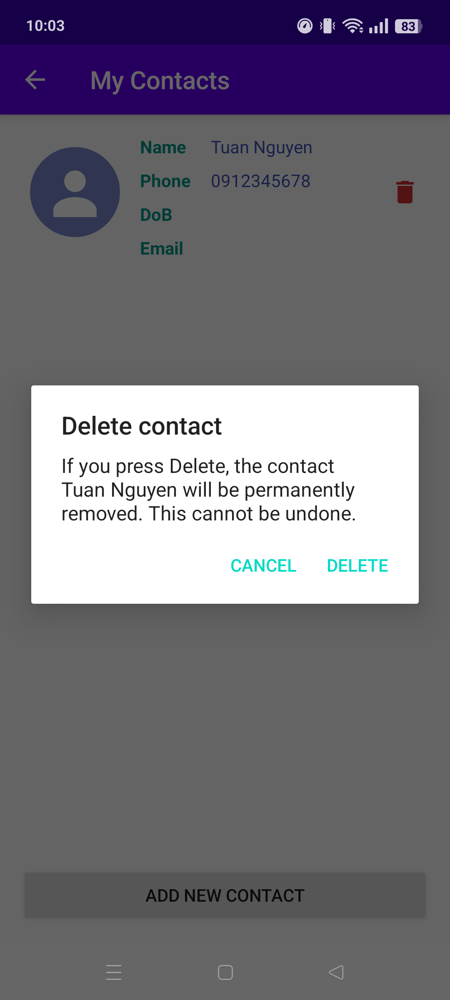

# 📇 My Contacts

A clean, lightweight contact manager for Android. Create, edit and delete contacts, give each person a colourful avatar, and browse everything in a smooth RecyclerView list — all stored locally with SQLite, no internet required.


## ✨ Features

- **Add contacts** with name, phone number, date of birth and email
- **Pick an avatar** for every contact from a grid of 8 built-in vector avatars
- **Smart validation** — name and phone are required (with format checking), date of birth and email stay optional; invalid email formats are rejected
- **Date picker** — the date of birth is chosen from a `DatePickerDialog`, so malformed dates are impossible
- **Edit in place** — tap any contact to reopen the form pre-filled and update it
- **Safe delete** — a confirmation dialog warns you before a contact is permanently removed
- **Offline-first** — everything is persisted in a local SQLite database
- **Fully resourced UI** — all strings, colours and styles live in Android resource files; avatars are density-independent vector drawables

## 📸 Screenshots

| Add a contact | Choose an avatar | Pick a date |
|:---:|:---:|:---:|
|  |  |  |

| Contact list | Edit a contact | Delete confirmation |
|:---:|:---:|:---:|
|  |  |  |

## 🏗️ Architecture & Tech Stack

| Layer | Technology |
|---|---|
| Language | Java 11 |
| UI | Android Views, ConstraintLayout, RecyclerView, AlertDialog, DatePickerDialog |
| Persistence | SQLite via `SQLiteOpenHelper` |
| Graphics | XML vector drawables |
| Build | Gradle 9.4 · Android Gradle Plugin 9.2 |

```
app/src/main/java/uk/ac/gre/wm50/contactdatabase/
├── MainActivity.java      # Entry form: create & edit contacts, validation, avatar picker
├── DetailsActivity.java   # Contact list screen (RecyclerView) with add-new & back navigation
├── DatabaseHelper.java    # SQLite schema + insert / update / delete / query
├── Person.java            # Contact model
├── PersonAdapter.java     # RecyclerView adapter: binds avatars, edit-on-tap, delete
└── AvatarAdapter.java     # Grid adapter for the avatar picker dialog
```

**Design note:** avatars are stored in the database by *resource name* (e.g. `avatar_3`) rather than by resource id, because ids are regenerated on every build while names are stable. The name is resolved back to a drawable at bind time with a safe fallback.

## 🚀 Getting Started

### Prerequisites

- Android Studio (Ladybug or newer)
- JDK 17+ (the version bundled with Android Studio works)
- An Android device or emulator running Android 8.0 (API 26) or higher

### Build & Run

```bash
git clone https://github.com/luphihung-dev/My-Contacts.git
cd My-Contacts
./gradlew assembleDebug
```

Or simply open the project in Android Studio and press **Run ▶**.

## 🎓 About

Developed as part of **COMP1786 – Mobile Application Design and Development** at the University of Greenwich, extending the Lecture 5 *Android Persistence* sample into a complete contact manager.

---

Made with ☕ by [luphihung-dev](https://github.com/luphihung-dev)
